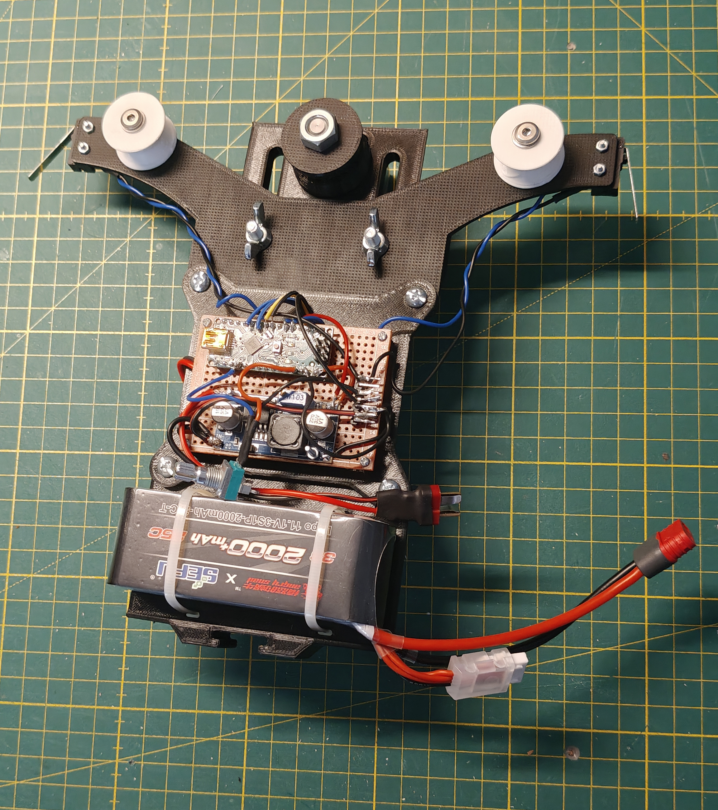
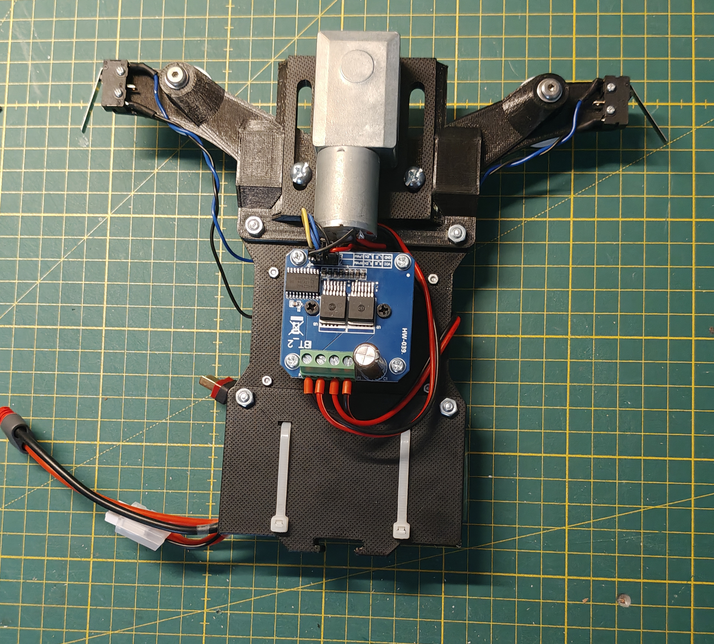
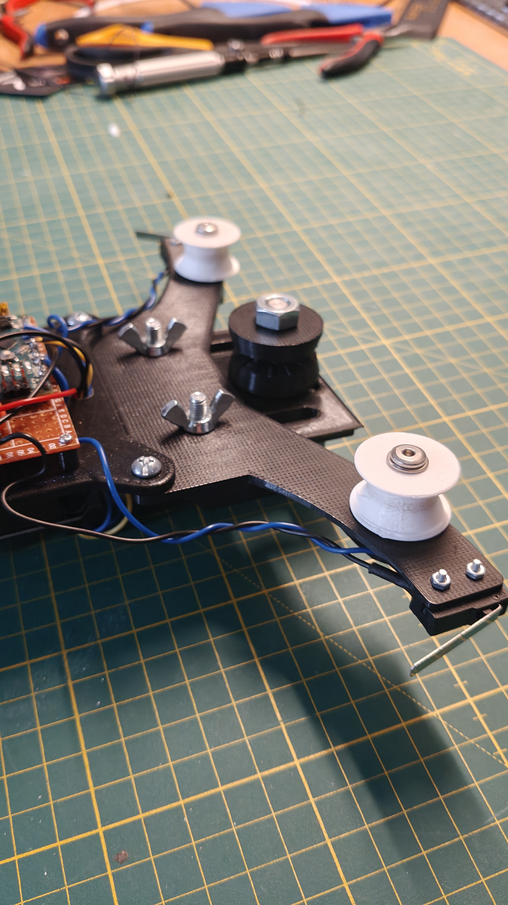
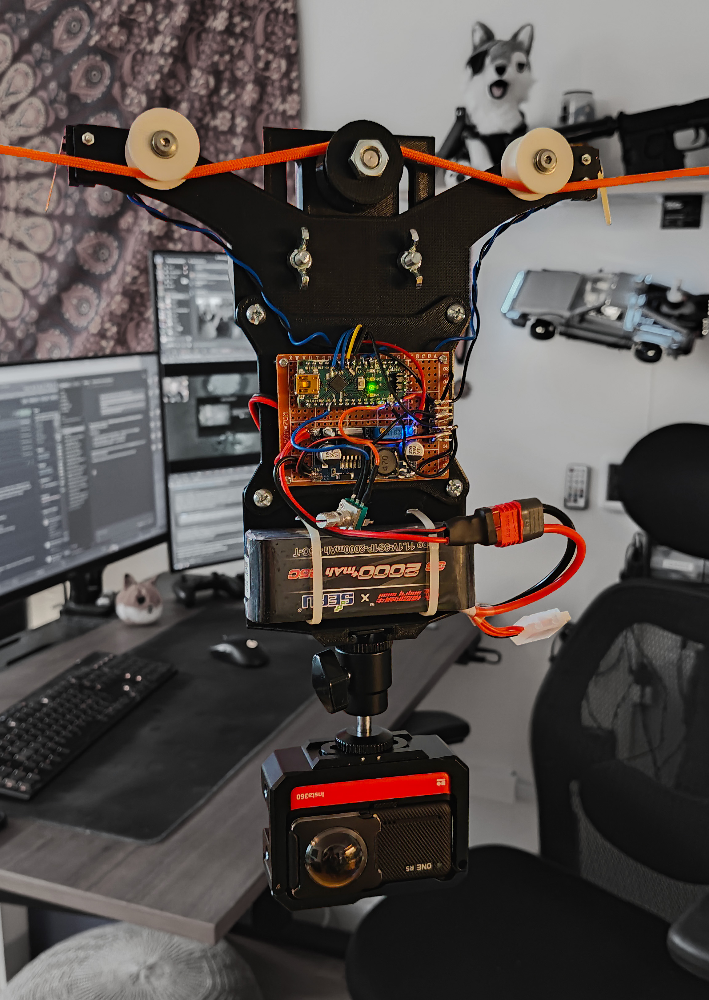

# Motorized DIY Cable Cam

A self-contained motorized cable cam system built around an Arduino Nano. Designed for small cameras. In my case I use a Insta360 One RS. Features automatic end-stop reversal, variable speed control via potentiometer, and runs entirely on a LiPo battery mounted on the carriage.

## Features

- Variable speed control via potentiometer
- Automatic direction reversal at end stops (limit switches)
- 2-second pause at each end before reversing
- Dead zone at bottom of potentiometer for full stop
- Fully self-contained. Arduino, driver, battery all ride on the carriage

## Hardware

See [PARTS.md](PARTS.md) for the full parts list.

## Wiring

See the [wiring](wiring/) folder for diagram:
- [CableCamWiring.svg](wiring/CableCamWiring.svg) - Complete wiring diagram - Arduino, Buck Converter, BTS7960, LiPo Battery, potentiometer, and limit switches

## How it works

The carriage rides along a steel cable using ball bearings. A worm gear motor drives a pulley that grips the cable, propelling the carriage. Two microswitches are mounted on opposite ends of the carriage — when a striker clamp on the cable triggers a switch, the motor stops, pauses, reverses direction, and ignores the switches for 5 seconds to allow the carriage to clear the striker.

Speed is controlled by a B10K potentiometer. Turning it all the way down stops the motor completely.

## Code

The main sketch is in [cable_cam/cable_cam.ino](cable_cam/cable_cam.ino).

### Adjustable settings

| Constant | Default | Description |
|----------|---------|-------------|
| `END_PAUSE_MS` | 2000 | Pause at end stop in milliseconds |
| `MIN_PWM` | 40 | Minimum PWM to keep motor moving |
| `DEAD_ZONE_BOT` | 100 | Pot dead zone threshold (0–1023) |
| `IGNORE_MS` | 5000 | Time to ignore switches after trigger |

## Pin mapping

| Arduino pin | Connected to |
|-------------|-------------|
| D5 | RPWM (BTS7960) |
| D6 | LPWM (BTS7960) |
| D7 | R_EN (BTS7960) |
| D8 | L_EN (BTS7960) |
| D2 | Limit switch left |
| D3 | Limit switch right |
| A0 | Potentiometer wiper |
| 5V | BTS7960 VCC + buck converter output |
| GND | Shared ground rail |

## Media

Here are some images of my rig as well as a video showing some example results and what the setup looks like in action.

